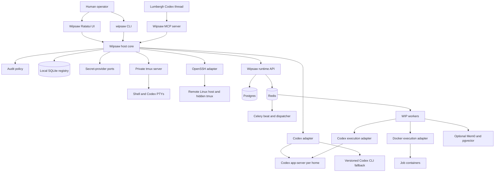
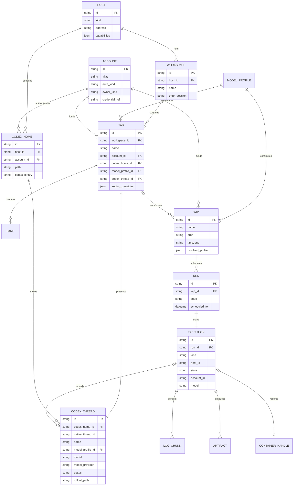
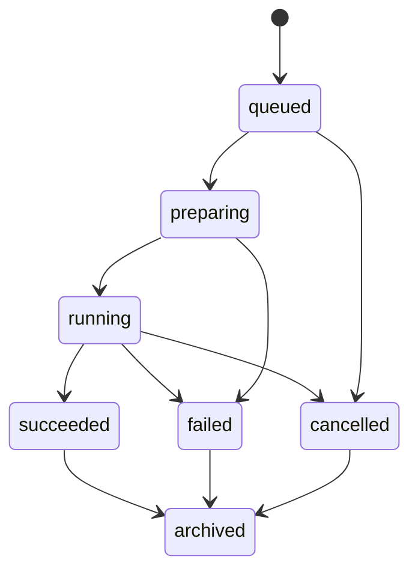

# Wipsaw Architecture Specification

Status: Proposed, with spike-backed ADRs noted as accepted
Date: 2026-08-08

## Requirements summary

Wipsaw is a Linux-only local control plane with two execution domains:

1. host-native durable terminals and Codex sessions; and
2. a containerized WIP scheduler/runtime transplanted from Wiphand.

It must support several local or remote hosts, Codex installations, Codex
homes, ChatGPT/Codex accounts, API credentials, model profiles, shells, and
scheduled jobs. Human TUI actions and Lumbergh agent actions must share the
same typed application layer.

The first deployment target is an individual Linux workstation or server. The
architecture should be comfortable with tens of workspaces, hundreds of tabs
and WIPs, and a long-lived history of runs and log chunks. It is not a
multi-tenant cloud service.

## Architecture assessment

### Wipsaw starting point

The Wipsaw directory was empty before these specifications. A modular monolith
is appropriate for the host application: one Rust workspace with clear domain
ports, one daemon, one CLI/TUI binary, and optional MCP/extension processes.

### Wiphand source assessment

Wiphand is a service-oriented Compose application with a FastAPI backend,
Postgres, Redis, Celery scheduler/workers, generic Codex and Docker executors,
an Astro/React frontend, and optional Mem0/pgvector services. It already owns
43 HTTP route declarations, run persistence, schedule previews, execution
profiles, Docker container IDs, and captured logs.

Its useful boundaries are reusable, but three issues must be corrected during
the transplant:

- public domain names are research-blog-specific;
- Codex article runs do not persist a supported Codex thread ID; and
- API/worker services currently receive the host root and Docker socket,
  creating excessive authority for a multi-account desktop tool.

## System diagram



## Deployment view

```text
Linux host
├── wipsaw / wipsawd / wipsaw mcp-server
├── private tmux socket and generated config
├── one Codex app-server endpoint per active Codex home
├── SQLite registry + audit index
├── Linux secret provider or encrypted headless fallback
└── Docker Compose project: wipsaw-runtime
    ├── api + migrate + optional web frontend
    ├── postgres + redis
    ├── beat + dispatcher + workers
    ├── optional specialized workers
    └── optional mem0 + pgvector
```

Remote hosts run only host-side components required by their registered
capabilities. The local daemon communicates over OpenSSH; no public Wipsaw
daemon port is required.

## Host module boundaries

| Module | Responsibility | Owns data | Exposes |
| --- | --- | --- | --- |
| `domain` | IDs, settings resolution, states, policies | Domain types only | Rust interfaces |
| `registry` | Hosts, homes, accounts, workspaces, tabs, links | SQLite rows | Repository ports |
| `tmux` | Private server, windows, panes, themes, key tables | Live PTYs in tmux | Terminal port |
| `codex` | App-server/CLI compatibility and thread lifecycle | No credentials; thread references | Codex port |
| `accounts` | Account aliases, ownership, login health | Credential references | Account port |
| `secrets` | Secret retrieval and unlock lifecycle | Secret material in provider | Secret port |
| `profiles` | Model, permissions, context, tools, shell layers | Profile documents | Resolver port |
| `wips` | Runtime API client and cached display projections | Cache only | WIP port |
| `hosts` | Local/SSH capability discovery and commands | Host capability cache | Host port |
| `audit` | Append-only action records and policy outcomes | Local audit index | Audit port |
| `ui` | Ratatui navigator, forms, settings, viewers | UI state only | Terminal UI |
| `mcp` | Structured tools for Lumbergh | No independent state | MCP stdio server |

The local alpha implements `ui` as a responsive three-table navigator. A
generated shell launcher sits between tmux and Bash/Zsh: it sources the user's
normal rc files, then defines Wipsaw's tab-aware shortcuts. This keeps tmux's
PTY durability and the user's Oh My Zsh environment while avoiding global rc
file mutation or shortcut shadowing.

## Runtime module boundaries

| Module | Responsibility | Owns data | Public API |
| --- | --- | --- | --- |
| WIPs | Schedule definitions, previews, CRUD | `wips` compatibility tables | `/api/v1/wips` |
| Runs | Occurrences, states, results | `runs` | `/api/v1/runs` |
| Executions | Backend handles and log streams | `executions`, `execution_logs` | `/api/v1/executions` |
| Profiles | Runtime/model/resource settings | `execution_profiles` | `/api/v1/execution-profiles` |
| Scheduler | Cron calculation and dispatch | next-run state | Internal + preview API |
| Executors | Docker, Codex, and future processes | Execution metadata | Internal port |
| Artifacts | Reports, files, reviews, result sinks | Artifact metadata | `/api/v1/artifacts` |
| Accounts | References to host-managed credentials | Non-secret account IDs | `/api/v1/account-references` |
| Memory | Optional agent memory | Mem0/pgvector | Internal adapter |

The runtime never writes the host SQLite registry. The host never writes the
runtime Postgres database directly.

## Domain model



## Identifier strategy

Public Wipsaw IDs are opaque UUIDv7 or ULID values encoded with a type prefix:

```text
wip_01J...
run_01J...
exec_01J...
tab_01J...
home_01J...
acct_01J...
```

Native Docker container IDs, Codex thread IDs, tmux targets, Celery task IDs,
and remote process IDs are backend handles stored under an execution. They can
be shown diagnostically but are never used as the stable API identity.

## Execution lifecycle



At dispatch time the runtime creates the `run_id` and `execution_id` before
starting Docker or Codex. The execution row is therefore available even if the
backend fails before returning a container or thread handle. Logs are appended
against `execution_id`. Backend handles may be attached later.

For Docker, Wipsaw stores container ID, image digest, labels, host, timestamps,
exit code, and captured logs. For Codex, it stores Codex home ID, native thread
ID, model, turn status, event cursor, and output. A combined job can have both.

## Account and secret model

An account record contains metadata and a `credential_ref`, never the secret.

Supported account authentication kinds:

- `existing_codex_home`: the first-run current home and its existing auth;
- `chatgpt_session`: a dedicated Codex home authenticated interactively;
- `codex_access_token`: token delivered to Codex login through stdin;
- `openai_api_key`: key delivered through stdin or the child environment;
- future provider-specific adapters supplied by trusted extensions.

Every ChatGPT/Codex login receives a distinct home. Wipsaw rejects registration
of the same writable home under two different accounts. API-funded profiles may
also use separate homes to keep sessions, usage, and settings attributable.
On an empty registry, Wipsaw adopts `CODEX_HOME` (falling back to `~/.codex`)
as the `current` account/home without copying or parsing its credential.

Secret-provider order is explicit, not automatic:

1. Linux Secret Service when a session keyring exists;
2. an encrypted, user-unlocked headless vault;
3. an external command/reference provider such as `pass`;
4. one-process stdin for ephemeral use.

Secrets are delivered only to the selected process/container. Generated launch
manifests contain placeholders such as `secret://account/acct_...`, and audit
events record the account reference, not credential content.

## Settings and model resolution

Settings are typed fields rather than an undifferentiated map. Each resolved
field retains provenance:

```json
{
  "model": {"value": "configured-model", "source": "wip:wip_01J..."},
  "account_id": {"value": "acct_01J...", "source": "profile:company"},
  "search": {"value": true, "source": "workspace:default"}
}
```

The resolver applies:

```text
global < host < account/home < named profile < workspace < tab or WIP < run override
```

Validation is capability-aware. A model/provider setting unavailable to the
chosen Codex binary or account fails before dispatch with a structured error.

## Host control protocol

The initial daemon listens on a user-owned Unix socket beneath
`$XDG_RUNTIME_DIR/wipsaw/`. TUI, CLI, and MCP clients issue the same typed
commands. The socket is not exposed over TCP.

Representative CLI operations:

```text
wipsaw workspace list
wipsaw tab create --workspace dev --name api --profile company
wipsaw thread resume <thread-id> --tab api
wipsaw account doctor company
wipsaw wip create --file morning-briefing.toml
wipsaw wip trigger <wip-id> --model <configured-model>
wipsaw run inspect <run-id>
wipsaw execution logs <execution-id> --follow
wipsaw service up
wipsaw doctor
wipsaw mcp-server
```

## Runtime API contracts

All endpoints use `/api/v1`, cursor pagination, idempotency keys for creates and
triggers, and a consistent error shape:

```json
{"error":{"code":"account_unavailable","message":"Company account is not logged in"}}
```

| Method | Path | Purpose |
| --- | --- | --- |
| `GET/POST` | `/api/v1/wips` | List or create WIPs. |
| `GET/PATCH/DELETE` | `/api/v1/wips/{wip_id}` | Read, update, archive/delete a WIP. |
| `POST` | `/api/v1/wips/{wip_id}/trigger` | Create a run and execution. |
| `GET` | `/api/v1/wips/{wip_id}/schedule-preview` | Preview occurrences and overlaps. |
| `GET` | `/api/v1/wips/{wip_id}/runs` | List runs for a WIP. |
| `GET` | `/api/v1/runs/{run_id}` | Read run state and result. |
| `POST` | `/api/v1/runs/{run_id}/cancel` | Request cancellation. |
| `GET` | `/api/v1/executions/{execution_id}` | Resolve observable execution state. |
| `GET` | `/api/v1/executions/{execution_id}/logs` | Page or follow persisted logs. |
| `GET` | `/api/v1/executions/{execution_id}/codex-thread` | Read the linked thread projection. |
| `GET` | `/api/v1/executions/{execution_id}/artifacts` | List result artifacts. |
| `GET/POST` | `/api/v1/execution-profiles` | Manage model/runtime profiles. |

Trigger response:

```json
{
  "wip_id": "wip_01J...",
  "run_id": "run_01J...",
  "execution_id": "exec_01J...",
  "state": "queued",
  "links": {
    "run": "/api/v1/runs/run_01J...",
    "logs": "/api/v1/executions/exec_01J.../logs"
  }
}
```

Execution projection:

```json
{
  "id": "exec_01J...",
  "kind": "docker_codex",
  "state": "running",
  "host_id": "host_local",
  "account_id": "acct_01J...",
  "model": "configured-model",
  "backend_handles": {
    "container": {"available": true},
    "codex_thread": {"available": true, "inspectable": true, "resumable": false}
  }
}
```

The ordinary response does not reveal raw credential material or require a
Docker container ID to fetch logs.

## MCP contract

`wipsaw mcp-server` exposes narrow operations corresponding to host and runtime
application services. Initial tools include:

- `workspace_list`, `tab_create`, `tab_move`, `tab_select`, `tab_settings_get`;
- `thread_list`, `thread_open`, `thread_inspect`, `thread_archive`;
- `wip_list`, `wip_get`, `wip_create`, `wip_update`, `wip_trigger`;
- `run_get`, `run_cancel`, `execution_logs`, `execution_artifacts`;
- `account_list`, `account_status`, `model_list`, `profile_resolve`;
- `host_list`, `host_doctor`, `service_status`.

Secret values, raw database access, arbitrary tmux command execution, and
arbitrary Docker socket access are not MCP tools.

## Wiphand migration map

| Wiphand source | Wipsaw public name | Initial storage strategy |
| --- | --- | --- |
| `research_requests` | WIPs | Keep table name behind repository compatibility layer, rename later. |
| `research_runs` | Runs | Keep table, add Wipsaw public ID and execution relation. |
| `executor_kind` | Execution backend | Preserve enum values, add adapters without rewriting history. |
| `execution_metadata` | Backend handle metadata | Migrate known fields into executions; retain raw compatibility JSON. |
| `raw_output` | Persisted logs/result | Backfill log chunks and preserve original payload. |
| `/research-requests` | `/wips` | Add new routes first; temporary deprecated aliases for migration tests only. |
| `research_admin.py` | `wipsaw wip` | Replace with Rust CLI using the same API contract. |
| Wiphand skill | Wipsaw skill | Rewrite terminology and point to CLI/MCP. |
| Wiphand frontend | Optional Wipsaw web dashboard | Rebrand schedules, runs, artifacts, and reviews. |
| Domain scripts | Extension job packs | Preserve, inventory, then classify by capability/brand. |

No Wiphand MCP implementation was found, so MCP is new Wipsaw work.

## Dependency analysis

### Confirmed source inventory

- Wiphand backend: 12 direct runtime dependencies and 2 development
  dependencies.
- Wiphand frontend: 8 direct runtime dependencies and 14 development
  dependencies.
- Compose: 9 default services and 11 with the optional agent-memory profile.
- External runtime dependencies include Docker Engine/Compose, tmux, Codex,
  OpenSSH, Postgres, and Redis.

### Wipsaw host dependency target

The Rust workspace should begin with focused dependencies: Tokio, Ratatui,
Crossterm, Clap, Serde, a TOML parser, SQLite, an HTTP client, UUID/ULID, and a
JSON-RPC client. Shelling out to tested tmux/OpenSSH binaries is preferred over
embedding terminal or SSH implementations in the first release.

The first Rust crate now keeps its dependency graph deliberately small: Clap,
Directories, Rusqlite with bundled SQLite, Serde/JSON, Thiserror, and UUID.
Ratatui, Crossterm, Tokio, HTTP, Python/runtime, and frontend dependencies will
be added only with the slices that exercise them. CI still needs `cargo deny`,
`cargo audit`, `cargo machete`, Python dependency checks, and frontend checks
after the source transplant.

## ADRs

### ADR-001: Use a private tmux server as the terminal backend

- **Status:** Accepted; local spike passed.
- **Context:** Wipsaw needs durable real PTYs, familiar tmux behavior, custom
  navigation, and recovery after UI failure.
- **Decision:** Launch a dedicated tmux socket and generated configuration.
  Prefer a compatible system binary and ship a tested fallback binary.
- **Consequences:** Wipsaw inherits tmux's robust multiplexing and can still
  provide a custom Ratatui navigator/status theme. Packaging and terminal
  compatibility require dedicated testing.
- **Alternatives considered:** Build a multiplexer/terminal emulator; use only
  system tmux; use terminal tabs owned by a desktop GUI.

### ADR-002: Build the host control plane as a Rust modular monolith

- **Status:** Accepted.
- **Context:** The product is Linux-first, terminal-heavy, long-lived, and
  initially developed as one product rather than independently deployed teams.
- **Decision:** Use a Rust workspace with ports/adapters and shared application
  services for TUI, CLI, daemon, and MCP.
- **Consequences:** One reliable binary family and clear ownership, with more
  upfront type design than a shell/JavaScript prototype.
- **Alternatives considered:** TypeScript/Ink, Go/Bubble Tea, separate
  microservices for every host concern.

### ADR-003: Transplant and evolve Wiphand rather than rewrite its scheduler

- **Status:** Accepted.
- **Context:** Wiphand already contains the required scheduler, workers,
  persistence, Docker/Codex execution, artifacts, memory, and web views.
- **Decision:** Import the Wiphand runtime into Wipsaw, introduce Wipsaw public
  APIs and vocabulary, and use compatibility repositories/migrations before
  physical database renames.
- **Consequences:** Faster capability parity and preserved tests, but a tracked
  de-Wiphanding migration is required.
- **Alternatives considered:** Keep Wiphand as an external permanent service;
  rewrite scheduler/runtime in Rust immediately.

### ADR-004: Prefer Codex app-server for thread control

- **Status:** Accepted behind a compatibility adapter; local spike passed.
- **Context:** Wipsaw must receive exact thread IDs and manage names/resume
  without scraping rollout files.
- **Decision:** Use app-server JSON-RPC per Codex home where supported. Maintain
  a versioned CLI fallback and capability detection because app-server remains
  experimental.
- **Consequences:** Strong thread semantics and streaming events, balanced by
  protocol-version testing.
- **Alternatives considered:** Scan rollout files; parse interactive terminal
  output; maintain a Codex fork as the only supported binary.

### ADR-005: Give every run a Wipsaw execution ID

- **Status:** Accepted.
- **Context:** Container IDs and Codex thread IDs are optional, backend-specific,
  and may appear only after dispatch.
- **Decision:** Allocate `run_id` and `execution_id` transactionally before
  dispatch and attach backend handles later.
- **Consequences:** Stable logs and inspection APIs survive container cleanup
  and executor changes.
- **Alternatives considered:** Return Docker/Celery/Codex IDs directly; use one
  ID for schedule and all occurrences.

### ADR-006: Isolate accounts with Codex homes and secret references

- **Status:** Accepted; full multi-account credential spike pending.
- **Context:** Users may have employer, personal, and API-funded identities.
- **Decision:** One writable Codex home per authenticated account; secret values
  stay in an explicit secret provider and are delivered through stdin or child
  environment only. A new local registry adopts the active machine Codex home
  as its zero-configuration `current` identity.
- **Consequences:** Clear attribution and reduced cross-account leakage, at the
  cost of more storage and lifecycle management.
- **Alternatives considered:** Swap `auth.json` in one home; store tokens in the
  Wipsaw database; require one account per machine.

### ADR-007: Harden the inherited Docker boundary before general release

- **Status:** Proposed.
- **Context:** Wiphand currently mounts `/` and `/var/run/docker.sock` into API
  and worker services.
- **Decision:** Move Docker authority behind a narrow executor component, use
  per-job approved mounts, preserve account scoping, and evaluate rootless
  Docker/Podman during spikes.
- **Consequences:** Some existing jobs may require explicit resource bindings;
  host compromise risk is materially reduced.
- **Alternatives considered:** Retain unrestricted socket/root mounts; run every
  WIP directly on the host; introduce a VM despite Linux-only scope.

### ADR-008: Separate host registry data from runtime scheduling data

- **Status:** Accepted.
- **Context:** Host tabs/homes must work when the container stack is down, while
  WIP scheduling needs transactional shared worker state.
- **Decision:** SQLite owns host registry/UI metadata; runtime Postgres owns WIPs,
  runs, executions, logs, and artifacts. Communicate through APIs.
- **Consequences:** Clear availability boundaries with small cached projections
  and no cross-database transaction.
- **Alternatives considered:** Put everything in Postgres; put scheduler state in
  host SQLite; allow both sides to write both databases.

## Risks and mitigations

| Risk | Impact | Likelihood | Mitigation |
| --- | --- | --- | --- |
| Experimental Codex protocol changes | Broken thread control | Medium | Capability negotiation, supported-version matrix, CLI fallback. |
| Bundled tmux incompatibility | Wipsaw cannot start on some distros | Medium | System-binary preference, pinned fallback, libc/terminal matrix spike. |
| Nested remote tmux key/display issues | Poor SSH UX | Medium | Hidden remote prefix/status, local control proxy, dedicated SSH spike. |
| Docker socket or broad mounts compromise host | Critical | High in inherited design | Narrow executor, approved mounts, rootless evaluation, audit. |
| Cross-account credential leakage | Critical | Medium | Separate homes, secret refs, redaction, account-attributed processes/tests. |
| Model unavailable for selected account | Failed dispatch | High | Preflight model/account capabilities and structured errors. |
| Logs lost after container removal | Missing observability | Medium | Stream/persist against execution ID before cleanup; retention policy. |
| Big-bang Wiphand rename breaks jobs | Capability regression | High | Compatibility API/repositories, contract tests, staged migration. |
| Extension executes untrusted code | Host compromise | Medium later | Trust manifests, signatures/origin, explicit executable permission. |
| Runtime stack unavailable | WIPs inaccessible | Medium | Host sessions remain usable; health UI and service recovery commands. |
